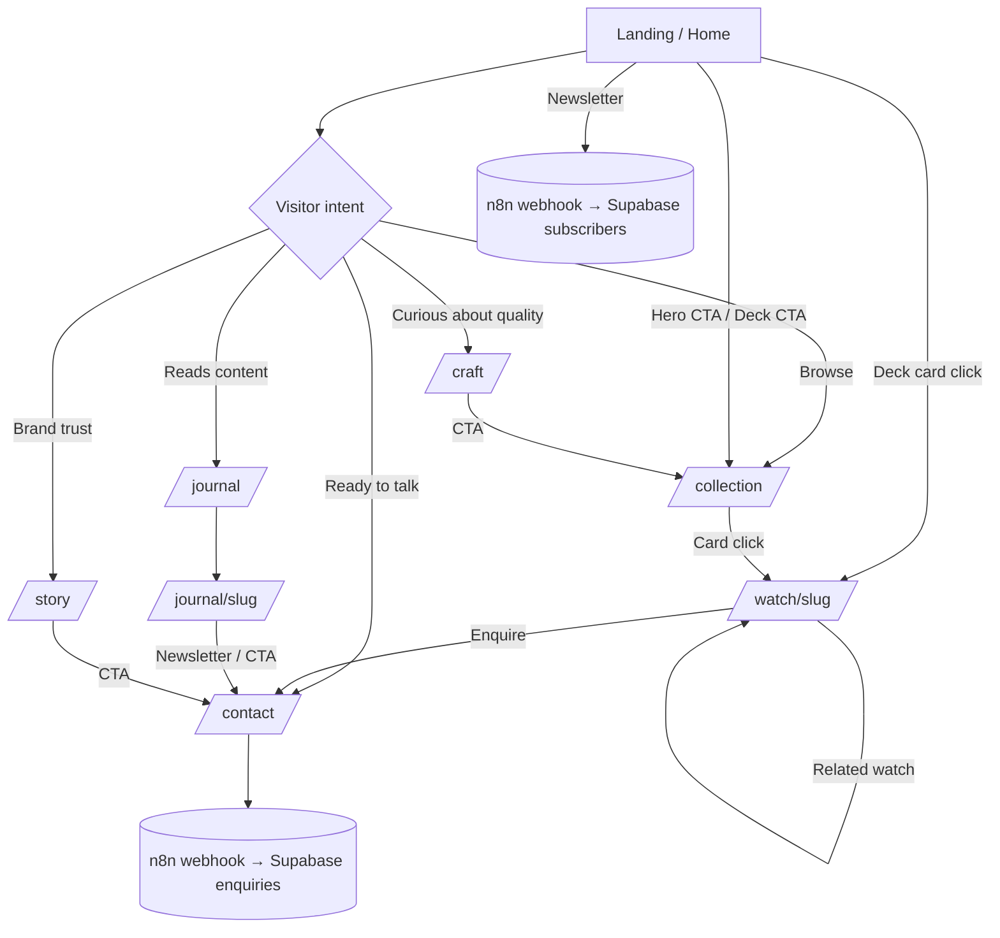

# SITEMAP — Premium 3D Watch Website

> **Read together with `projectplan.md`.** This file defines *what exists, where it lives, how pages connect, and which components/interactions each page uses*, so an AI (or developer) can reproduce the site's structure and behavior without guessing.
> Working brand: `[BRAND_NAME]` · Phase 1 scope = marketing + enquiry (no checkout).

---

## 1. SITE TREE

```
/                                  Home (immersive hero + scroll story)
├─ /collection                     All watches (grid / list + filters)
│   └─ /watch/[slug]               Product detail (3D viewer)     e.g. /watch/marlin-batman
├─ /craft                          Technology, materials, exploded-view story
├─ /story                          Brand story, values, team
├─ /journal                        Editorial listing
│   └─ /journal/[slug]             Article
├─ /contact                        Enquiry form + contact details
├─ /legal/privacy                  Privacy policy
├─ /legal/cookies                  Cookie policy (+ consent manager)
├─ /legal/terms                    Terms
└─ /404                            Not found (keeps gradient + floating bubbles)
```

Phase 3 (optional, not in Phase 1): `/cart`, `/checkout`, `/account`, `/orders/[id]`.

---

## 2. ROUTE TABLE

| Route | Page name | Purpose | Primary CTA | 3D? | Gradient bg | Template |
|---|---|---|---|---|---|---|
| `/` | Home | Impress, introduce hero watch, push to collection | Explore the collection | Yes (hero watch, craft) | Yes (Soffit, pointer-reactive) | `home` |
| `/collection` | Collection | Browse/filter watches | Open a watch | No (renders only) | Yes (calmer preset) | `listing` |
| `/watch/[slug]` | Product | Convince & capture enquiry | Enquire about this watch | Yes (full viewer) | Yes (colorway-driven palette) | `product` |
| `/craft` | Craft | Prove quality/technology | See the collection | Yes (exploded view) | Yes (dark story preset, optional) | `story-3d` |
| `/story` | Story | Build brand trust | Contact us | No | Yes | `editorial` |
| `/journal` | Journal | Content/SEO | Read article | No | Yes | `listing` |
| `/journal/[slug]` | Article | Read | Subscribe | No | Static (low-motion) | `article` |
| `/contact` | Contact | Lead capture | Send enquiry | No | Yes | `form` |
| `/legal/*` | Legal | Compliance | — | No | Flat colour (no WebGL) | `legal` |
| `/404` | Not found | Recover | Back home | No | Yes | `error` |

---

## 3. GLOBAL (APPEARS ON EVERY PAGE)

| Element | Details |
|---|---|
| **Gradient canvas** `#bg-gl` | Soffit WebGL2, fixed, z 0; persists across route changes; palette tweens per page/colorway |
| **Bubbles layer** `#bubbles` | Rising PNG bubbles, fixed, pointer-events none (off on legal pages) |
| **Header** | Logo · glass pill nav (Home, Collection, Craft, Story, Journal) · **Contact** pill; hide on scroll down, show on scroll up; mobile = full-screen overlay menu |
| **Custom cursor** | Dot + ring; states: default, link, view, drag, play, read (desktop/fine pointer only) |
| **Footer** | Closing CTA line, newsletter form, social links (Instagram, X, LinkedIn, YouTube), legal links, giant wordmark with parallax |
| **Preloader** | Home only, once per session, ring + counter, waits for GLB + fonts + first gradient frame |
| **Consent manager** | Cookie banner (Functional always on; Statistics/Marketing optional) |
| **Page transition** | 0.7 s: palette shift + content fade/slide; card → product shared-element expand |
| **Smooth scroll** | Lenis synced with GSAP ScrollTrigger |

---

## 4. PAGE STRUCTURES

### 4.1 `/` — HOME
Sections in scroll order. `ID` is the anchor/component name used in code.

| # | ID | Section | Content | Layout | Key interaction | Pinned? |
|---|---|---|---|---|---|---|
| H0 | `preloader` | Preloader | Ring closing like a bezel + counter | Fullscreen overlay | Ring scales away → reveals hero | — |
| H1 | `header` | Header | See §3 | Fixed | Magnetic Contact pill | — |
| H2 | `hero` | Hero | Eyebrow, headline "Built for / the *Deep*", paragraph, CTA, WR 200M badge; center 3D watch; right: colorway carousel + 2nd headline "Precision, *Sealed*" | 100vh, 3 columns (left text · center watch · right carousel) | Watch tilts to cursor; floating decor with parallax + repulsion; bubbles; **colorway switch** (spin 720° + texture swap + palette morph + decor implode/explode) | No |
| H3 | `statement` | Statement | One big paragraph about 200 m / durability | Full width, centered | Word-by-word opacity scrub | Sticky |
| H4 | `deck` | **Showcase deck (waterfall)** | Left: eyebrow, headline "The Deep / *Collection*", paragraph, CTA. Right: 7 watch cards, counter, progress rail, rotated name | 2 columns, pinned | Scroll-driven stack: upcoming above (smaller), active at bottom (large), passed cards fold & drop; snap per card; click card → product | **Yes** (7 × 100vh) |
| H5 | `craft` | Craft / exploded view | 4 numbered callouts: bezel, crystal, dial & lume, sealed case (**verify specs**) | Centered 3D + side callouts | Scroll scrubs explode + camera orbit | **Yes** (3–4 × 100vh) |
| H6 | `specs` | Spec numerals + marquee | Giant stat pairs (e.g., `200 M` water resistance) + looping keyword marquee | Full width | Marquee speed/skew follows scroll velocity | No |
| H7 | `reviews` | Reviews | Slider: quote + two stat chips | Centered | Drag to slide, cursor `DRAG` | No |
| H8 | `journal-teaser` | Journal teaser | 3 cards: image, tag, title | 3-col grid | Image reveal, cursor `READ` | No |
| H9 | `closing` | Closing CTA + Footer | "Let's find your watch", newsletter, links, giant wordmark | Full width | Magnetic CTA, wordmark parallax | No |

**Home → outgoing links:** H2 CTA → `/collection` · H4 CTA → `/collection` · H4 card click → `/watch/[slug]` · H5 CTA → `/craft` · H8 cards → `/journal/[slug]` · H9 CTA → `/contact`.

### 4.2 `/collection`
| Section | Content | Notes |
|---|---|---|
| Intro | Eyebrow `COLLECTION · VOL. 01`, headline with gradient emphasis word, 1-line intro | Text reveal |
| Filter bar | Collection (Diver, Dress, Chrono…), Colorway, Sort (Featured, Newest) | Sticky under header; pill buttons |
| Grid | Watch cards (render, name, tag, price or "Enquire") | 3-col desktop / 2 tablet / 1 mobile; hover = tilt + glare + alt-angle render; cursor `VIEW` |
| CTA band | "Can't decide? Talk to us" | → `/contact` |

### 4.3 `/watch/[slug]` — PRODUCT (template; first instance `marlin-batman`)
| Section | Content | Interaction |
|---|---|---|
| P1 Viewer | Large `<model-viewer>`, name, tagline, price/"Enquire", colorway swatches, CTA **Enquire about this watch** | Drag rotates watch; secondary drag on bezel rotates the bezel; hotspots (bezel, crown, date window, strap) with popover; **colorway switch** (§9B in plan); hands show real time |
| P2 Highlights | 3–4 feature rows (200 m water resistance, rotating bezel, luminous markers, resin strap — **verify against real specs**) | Text reveals, small 3D close-up crops |
| P3 Specs table | Label/value rows (case, bezel, dial, movement, water resistance, strap, dimensions) | Accordion on mobile; values tagged `[VERIFY]` until confirmed |
| P4 Gallery | 4–6 renders/photos | Horizontal scroll, cursor `DRAG` |
| P5 Colorways | All colorways as cards (re-uses hero carousel card) | Click = switch in P1 and scroll to top |
| P6 Related | 3 other watches | Same card as collection |
| P7 Enquiry strip | Inline form (name, email, message; prefilled watch + colorway) | Submit → n8n webhook |

### 4.4 `/craft`
| Section | Content | Interaction |
|---|---|---|
| C1 Intro | Big statement | Word reveal |
| C2 Exploded view | Watch separates into parts with numbered callouts | Pinned scroll scrub (3D or image sequence) |
| C3 Materials | 3–4 close-up cards (steel, crystal, resin, lume) | Image reveal + parallax |
| C4 Lume demo | "Lights off" toggle: page darkens, lume glows | Toggle button; gradient palette → dark preset |
| C5 Testing | Water-resistance explainer, numbers | Counter animation |
| C6 CTA | → `/collection` | Magnetic |

### 4.5 `/story`
Hero statement · timeline (3–5 milestones) · values (3 columns) · team (optional) · press/logo marquee (placeholder) · CTA → `/contact`.

### 4.6 `/journal`, `/journal/[slug]`
Listing: featured post + grid, category filter. Article: cover reveal, reading-progress bar, body, related posts, newsletter.

### 4.7 `/contact`
Left: headline + contact details (email, phone/WhatsApp, address placeholder). Right: form (name, email, phone optional, interest dropdown = watch list, message, consent checkbox). Success state: bezel-ring checkmark animation. Backend: n8n webhook → Supabase `enquiries`.

### 4.8 `/legal/*` & `/404`
Legal: plain typography, no WebGL, no bubbles. 404: gradient + giant `404` in Braden Soft, floating bubbles, "Back to home" pill.

---

## 5. NAVIGATION FLOW (MERMAID)



---

## 6. COMPONENT INVENTORY

| Component | Used on | Props / data | Behavior |
|---|---|---|---|
| `GradientBackground` | All | `preset` | Soffit canvas; `setPreset(name)` tweens 5 colours in 1.5 s |
| `Bubbles` | All except legal | `interval=400` | Spawns `bubble.png`, 10–30 px, rise 4–10 s |
| `Header` / `NavPill` / `ContactPill` | All | `activeRoute` | Glass, hide/show on scroll, magnetic |
| `Cursor` | All (fine pointer) | `state, label` | Dot + lerp ring; reads `data-cursor` attributes |
| `HeroWatch3D` | Home, Product | `src, colorway, tilt` | model-viewer; cursor tilt; spin transition; live hands |
| `FloatingDecor` | Home hero, 404 | `layers[fg,bg,far]` | Parallax + repulsion; paused during switch |
| `ColorwayCarousel` | Home hero, Product | `colorways[]` | Cards w/ hover pop; click triggers `switchColorway()` |
| `ShowcaseDeck` | Home | `watches[]` (7) | Pinned waterfall; `place(card, d)` |
| `DeckCard` | Deck | `index, total, tag, name, tagline, image, palette` | Glass pill, tag, scrim, title |
| `DeckCounter` + `ProgressRail` | Deck | `p, total, activeName` | Slot-roll digits; glowing dot; rotated label |
| `StatementReveal` | Home, Craft, Story | `text` | Word-by-word scrub |
| `ExplodedView` | Home, Craft | `parts[], steps[]` | Pinned scrub of part offsets/camera |
| `StatPair` | Home, Reviews | `value, label` | Giant numerals + counter animation |
| `Marquee` | Home, Story | `items[], speed` | Duplicate track, velocity skew |
| `ReviewSlider` | Home | `reviews[]` | Drag; quote + stat chips |
| `WatchCard` | Collection, Related | `watch` | Tilt + glare, alt render on hover |
| `Hotspot` | Product | `x,y,z,label` | Popover on hover/focus |
| `SpecTable` | Product | `specs[]` | Rows / accordion on mobile |
| `EnquiryForm` | Product, Contact | `watchId?, colorwayId?` | Validation, honeypot, webhook POST |
| `NewsletterForm` | Footer, Article | `source` | Email only, webhook POST |
| `PageTransition` | Global | — | Palette shift + fade/slide + shared-element |
| `Preloader` | Home | — | Ring + counter |
| `ConsentManager` | Global | — | Functional / Statistics / Marketing |

---

## 7. STATE MODEL (GLOBAL)

```json
{
  "route": "/",
  "pointer": { "x": 0, "y": 0, "px": 0, "py": 0 },
  "gradient": { "preset": "hero", "isTweening": false },
  "watch": { "activeSlug": "marlin-batman", "activeColorway": "batman", "isSwitching": false, "switchSpin": 0 },
  "deck": { "progress": 0, "activeIndex": 0, "total": 7 },
  "ui": { "menuOpen": false, "cursorState": "default", "lightsOff": false, "reducedMotion": false },
  "device": { "fineHover": true, "lowPower": false }
}
```
Rules:
- `isSwitching === true` blocks new colorway clicks and pauses decor repulsion
- `deck.activeIndex = round(deck.progress)`; counter, rail dot and rotated label read only this value
- `reducedMotion === true` → no spin, no float, deck becomes a static vertical list, gradient `speed = 0`
- `lowPower === true` → disable particles, flow field, card blur

---

## 8. CONTENT & DATA MODEL (WHAT EACH PAGE READS)

| Page | Reads |
|---|---|
| Home | `watches (is_featured)`, `colorways` for hero, `watch_media`, `reviews`, `journal_posts` (3 latest) |
| Collection | `watches`, `colorways`, `watch_media` (primary render) |
| Product | `watches` (by slug), `colorways`, `watch_media`, `watch_specs`, related `watches` |
| Craft / Story | Static copy + `watch_media` |
| Journal | `journal_posts` |
| Contact / Forms | Writes: `enquiries`, `subscribers` |

Watch slugs (Phase 1 slots): `marlin-batman` (real), `slot-02` … `slot-07` (placeholders until assets exist).

Deck card data shape:
```json
{
  "slug": "marlin-batman",
  "index": 1,
  "total": 7,
  "tag": "DIVER",
  "chapter": "CHAPTER 01",
  "name": "Marlin Batman",
  "tagline": "[PLACEHOLDER — one line]",
  "image": "/assets/img/marlin-batman-front.webp",
  "palette": ["#d4c8e8", "#dcdcf3", "#e0e4f5", "#f5f5fd"]
}
```

---

## 9. INTERACTION ↔ PAGE MATRIX

| Interaction | Home | Collection | Product | Craft | Story | Journal | Contact |
|---|:-:|:-:|:-:|:-:|:-:|:-:|:-:|
| Soffit gradient (pointer-reactive) | ✔ | ✔ | ✔ | ✔ | ✔ | ✔ | ✔ |
| Bubbles | ✔ | ✔ | ✔ | ✔ | ✔ | ✔ | ✔ |
| Custom cursor + states | ✔ | ✔ | ✔ | ✔ | ✔ | ✔ | ✔ |
| Magnetic buttons | ✔ | ✔ | ✔ | ✔ | ✔ | ✔ | ✔ |
| 3D watch cursor tilt | ✔ | — | ✔ | ✔ | — | — | — |
| Colorway switch transition | ✔ | — | ✔ | — | — | — | — |
| Floating decor + repulsion | ✔ | — | — | — | — | — | — |
| Pinned scroll (deck / exploded) | ✔ | — | — | ✔ | — | — | — |
| Text / image reveals | ✔ | ✔ | ✔ | ✔ | ✔ | ✔ | ✔ |
| Card tilt + glare | ✔ (deck) | ✔ | ✔ (related) | — | — | — | — |
| Marquee | ✔ | — | — | — | ✔ | — | — |
| Lights-off lume toggle | — | — | — | ✔ | — | — | — |

---

## 10. SEO & META (per template)

| Template | `<title>` pattern | Meta description | Schema |
|---|---|---|---|
| home | `[BRAND_NAME] — Premium Diver Watches` | One sentence value prop, ≤ 155 chars | `Organization`, `WebSite` |
| listing | `Collection — [BRAND_NAME]` | Collection summary | `CollectionPage`, `ItemList` |
| product | `{Watch name} — [BRAND_NAME]` | Tagline + key spec | `Product` (no price until set) |
| article | `{Post title} — Journal` | Excerpt | `Article` |
| others | `{Page} — [BRAND_NAME]` | One line | `WebPage` |

Open Graph image: 1200 × 630 render of the hero watch on the gradient. `sitemap.xml` and `robots.txt` generated at build time from the route table in §2.

---

## 11. AI UNDERSTANDING NOTES (READ FIRST)

1. The **gradient canvas, bubbles and cursor are global and persistent** — they must not be re-created on navigation.
2. **Only Home (hero + craft), Craft and Product run live 3D.** Every other watch image is a pre-rendered transparent WebP.
3. The **deck is the signature section** — implement it exactly with the `place(card, d)` rules in `projectplan.md §9A`.
4. **Colorway = (bezel texture + strap texture + gradient palette + accent text/name/price)**. Changing one always changes all four.
5. **Never recolour by editing shader code** — only the `CONFIG` colours.
6. Anything marked `[PLACEHOLDER]` or `[VERIFY]` must stay visibly marked until the client confirms; do not invent watch specs, prices, or reviews.
7. Phase 1 has **no checkout**: every "buy" intent routes to Enquire → `/contact` or the inline enquiry form.
